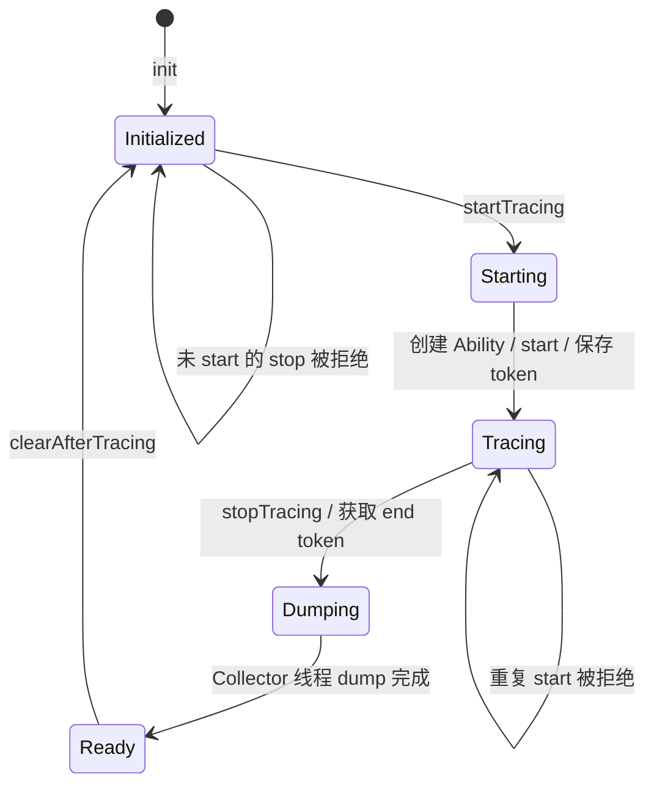

# App 端 SDK

> 适用对象：接入 SDK、排查端上生命周期或扩展 Trace Ability 的 Android/Java 贡献者。

## 正文

### 公共 API

`com.bytedance.rheatrace.RheaTrace3` 是源码注释明确声明的唯一外部 API：

| 方法 | 行为 | 约束 |
| --- | --- | --- |
| `init(Context)` | 主进程中初始化 TraceManager，可能启动启动阶段采集，并启动 HTTP 服务 | 应尽可能早地在 `attachBaseContext` 调用；非主进程直接返回 |
| `captureStackTrace(boolean force)` | 转发到 Native `TraceGlobal.capture`，在 Collector 工作时主动抓取当前线程栈 | `force=true` 只绕过时间间隔限制，不保证采集一定成功 |
| `beginStackTiming()` / `endStackTiming()` | 显式开启/结束全进程抓栈性能统计；`endStackTiming()` 返回汇总日志 | 必须在同一线程配对；复用 `enableStackCaptureStats` 开关 |
| `initOnline(Application, OnlineTraceConfig)` | 启动低损耗线上常驻采集 | API 26+、64 位 arm64、主进程；与调试模式互斥 |
| `exportStackData(startNs, endNs, callback)` | 按 elapsed realtime 半开区间异步导出 | 不判断卡顿，不清空缓冲区；同一时刻只执行一个任务 |
| `exportAllStackData(callback)` | 异步导出快照时全部有效记录 | RingBuffer 已覆盖的数据无法恢复 |
| `exportJankTrace(event, callback)` | 导出单次卡顿的 manifest v3 产物 | 业务方提供事件、会话、场景、消息边界、阈值和尝试采样次数 |

noop 制品保留相同类和方法签名，方法体为空。业务代码只依赖 `RheaTrace3`，不应直接使用 `TraceManager`、`TraceProperties` 或 `trace.*` 包。

### 显式抓栈性能统计

开启 `enableStackCaptureStats` 后，调用 `beginStackTiming()` 会清空旧数据并开启一次全进程统计会话。会话期间，`SamplingCollector::request()` 统计完整成功抓栈请求的耗时，以及因未达最小采样间隔而拒绝的调用次数和浪费时间。调用 `endStackTiming()` 会停止会话、快照数据，并返回如下字符串：

```text
stack capture stats: success_count=12, min_ms=0.081, median_ms=0.126, avg_ms=0.143, max_ms=0.310, capture_total_ms=1.716, rate_limited_count=35, rate_limited_wasted_ms=0.052
```

没有成功抓栈样本时，`min_ms`、`median_ms`、`avg_ms` 和 `max_ms` 返回 `N/A`，`capture_total_ms` 返回 `0.000`。统计不再使用 5 秒窗口，不会自动打印 Logcat，只由调用方处理 `endStackTiming()` 的返回值。

begin/end 必须在同一线程配对。统计是全进程的，因此不支持重叠会话；新的 begin 会替换尚未结束的旧会话，旧会话后续 end 返回空字符串。未匹配、跨线程、统计开关关闭、采集暂停/停止，或会话跨越采集启停/线上开关切换时，`endStackTiming()` 返回空字符串。未显式 begin 时，抓栈热路径只做开关和会话激活状态判断，不读取统计时钟、不保存样本。

### 卡顿元数据

卡顿导出不会改变通用堆栈导出协议。初始化时通过 `OnlineTraceConfig` 设置匿名设备 ID、构建 ID、环境和渠道；每次卡顿使用不可变 `JankEvent` 冻结 `eventId`、发生时间、会话、场景、消息边界、阈值和 `attemptedSampleCount`。SDK 从 Android 应用与系统信息中补充包名、版本、系统版本、设备型号、进程级 UUID 和实际最小采样间隔。

线上 v1/v3 manifest 与 `sampling.bin` extra 使用同一个进程级 canonical UUID v4 `processId`，并写入 `threadScope: "main"`。UUID 在 Android 进程生命周期内稳定；线上二进制记录只允许出现一个 tid，报告固定输出该线程的 `threadName: "main"`，不增加 `mainThreadId`。调试/离线采样路径仍保留数值 PID 的 extra 语义。

`eventId` 必须由调用方在确认逻辑卡顿时生成并在重试中复用。重试应读取 `getPendingJankFiles()` 返回的既有 ZIP，而不是重新构造事件；成功上传后使用 `deleteJankFile()` 删除。卡顿 ZIP 使用最新的 manifest v3 契约；上传时应遵循服务端的卡顿产物接口，SDK 本身只负责生成、校验和枚举本地文件。

### 初始化和主进程判断

`ProcessUtils.isMainProcess` 通过当前 PID、`ActivityManager` 和包名判断主进程。判断通过后，`TraceManager.init`：

1. 检查 `debug.rhea3.startWhenAppLaunch`，为 `1` 时同步调用 `startTracing(false)`；
2. 计算内部目录 `<filesDir>/rhea/tracing/<pid>`；
3. 在新线程中启动 `HttpServer`，并把端口写入 `<externalFilesDir>/rhea-port/<port>`。

启动采集发生在 `tracingDirPath` 赋值之前，但 dump 只在后续 stop 时使用该路径；正常初始化顺序下 HTTP 服务和路径会在 CLI 停止采集前准备完成。

### TraceManager 状态机



`traceTokens != null` 是当前唯一的采集中标志。普通采集从 HTTP 线程异步启动 Ability；启动阶段采集同步启动。stop 会先清空 `traceTokens`，随后依次 stop Ability，再把 dump 工作投递到独立 HandlerThread。HTTP 下载通过 `dataFlushFinished` 等待 dump 完成。

### Ability 与配置抽象

- `TraceMeta` 保存能力名、是否核心数据、数组偏移、Ability 类型和配置创建器类型；当前只有 `Sampling`。
- `TraceAbilityCenter` 按 TraceMeta 反射创建并缓存 Ability。
- `TraceConfigurations` 按 TraceMeta 反射创建并缓存配置。
- `TraceAbility.start` 首次创建 Native Collector；嵌套 start 增加 `activeCount` 并更新可变配置。
- `TraceAbility.stop` 返回结束 token；`activeCount` 降为 0 时停止 Native Collector。
- `dumpTokenRange` 只为核心能力写入额外 JSON；调试/离线路径的 `processId` 仍为数值 PID，线上路径则写入 UUID `processId`、`threadScope` 及导出范围、快照、mapping、应用名和 `onlineMode` 等字段。

### Sampling 默认配置

`SamplingConfigCreator` 当前设置：boottime 时钟、相同的主/其他线程采样间隔、启用 rusage、对象分配统计、wakeup、线程名和 shadow pause。容量及间隔来自系统属性，缺失或非法时回退到 `SamplingConfig` 常量。

配置通过 `SamplingConfig.deflate()` 压缩为固定顺序的 `long[]` 传入 JNI。任何字段增删或顺序变化都属于 Java/Native 内部接口变更，必须同步修改 Native `SamplingConfig` 解析。

### 线程与错误行为

- HTTP Server 线程：接收控制与下载请求。
- Ability 异步启动线程：确保新线程路径触发相关 Hook 初始化。
- `RheaCollector` HandlerThread：执行 dump，避免阻塞 stop 请求线程。
- 重复 start、未 start 就 stop、Native 全局初始化失败、无可用 TraceMeta 会记录错误并返回 `false`。
- `HttpServer` 对 start/stop 当前不检查布尔返回值，HTTP 200 不等价于 Collector 一定成功；真正下载失败通过 query/error 和文件存在性表现。

## 相关源码

- [RheaTrace3](../rhea-library/rhea-inhouse/src/main/java/com/bytedance/rheatrace/RheaTrace3.java)
- [TraceManager](../rhea-library/rhea-inhouse/src/main/java/com/bytedance/rheatrace/TraceManager.java)
- [TraceAbility](../rhea-library/rhea-inhouse/src/main/java/com/bytedance/rheatrace/trace/base/TraceAbility.java)
- [SamplingConfigCreator](../rhea-library/rhea-inhouse/src/main/java/com/bytedance/rheatrace/trace/sampling/SamplingConfigCreator.java)

## 验证方式

1. 在主进程与远程进程各调用一次 `RheaTrace3.init`，确认只有主进程创建 `rhea-port`。
2. 连续请求两次 start、两次 stop，检查 `RheaTrace:Manager` 日志和 HTTP 返回的差异。
3. 修改采样间隔后通过 debug query 核对 token 范围和容量，不把 HTTP 200 当作唯一成功信号。

## 相关文档

- [快速开始](getting-started.md)
- [总体架构](architecture.md)
- [配置参考](configuration-reference.md)
- [Native 实现](native-runtime.md)

### 请求分布诊断

`endStackTiming()` 在原有耗时汇总后追加 `request diagnostics`、按线程汇总和 10 ms 桶。
无需新增开关，仍需启用 `enableStackCaptureStats`，且每次 begin/end 必须配对。
返回值可能超过 Logcat 单条长度，请逐行打印或保存到文件；SDK 不自动打印。

- `request_count` 统计通过暂停、在线开关及线程过滤、进入限流判断的请求；`admitted_count` 表示放行。
- `walk_failed_count` 表示 `visitOnce` 失败或栈深度校验未通过；`success_count` 沿用写入路径完成口径，不保证导出 ZIP 保留全部样本，也不等于完整栈校验通过。
- `pending_count` 表示快照时尚未完成的请求。跨会话的迟到结果不污染新会话。
- `types` 使用 SamplingRecord.h 的 SamplingType 数字值，其中 9 为对象分配、10 为 JNI。
- `session_start_ns/session_end_ns` 和桶使用 BOOTTIME；`clock_id/interval_ns` 是实际限流时钟和该线程首次请求时的间隔。
- `first_request_ms/last_request_ms` 相对于会话开始；`max_request_gap_ms` 不包含首尾空白，尾部单列 `tail_gap_ms`。
- `initial_gate_age_ms` 为首个请求时距离此前放行的时间，使用限流时钟；没有前次放行时为 N/A，并非精确的会话起点年龄。
- 空桶也输出。最多记录 64 个线程及每线程前 10 秒的桶，`omitted_count` 非零表示诊断不完整；超时后的已跟踪线程仍累计汇总。

连续空桶说明缺乏 Hook 请求；持续有请求且失败多说明抓栈失败；持续有请求但放行少应检查实际间隔、时钟与 force 行为。
10 ms 是事件触发采样的最小间隔，桶边界不是限流边界。诊断会增加锁、计时与内存开销，不宜作为无扰动性能基准。
验证记录见 [原生运行时](native-runtime.md#请求分布诊断)。测试源码为
[RequestDiagnosticsTest.cpp](../rhea-library/rhea-inhouse/src/test/cpp/RequestDiagnosticsTest.cpp)，它不属于 Gradle JVM 测试任务。
可用 NDK clang++ 编译（`--target=aarch64-linux-android23 -std=c++17 -static-libstdc++`），通过 adb push 到 `/data/local/tmp/` 后运行。

调用示例（每条消息均结束会话，仅长消息打印，避免未配对 begin/end）：

```java
// 消息开始时调用。
RheaTrace3.beginStackTiming();
// 消息结束时先取统计，再执行日志、导出等工作。
String report = RheaTrace3.endStackTiming();
if (isSlowMessage) {
    for (String line : report.split("\\n")) {
        Log.i("StackDiagnostics", line);
    }
}
```
