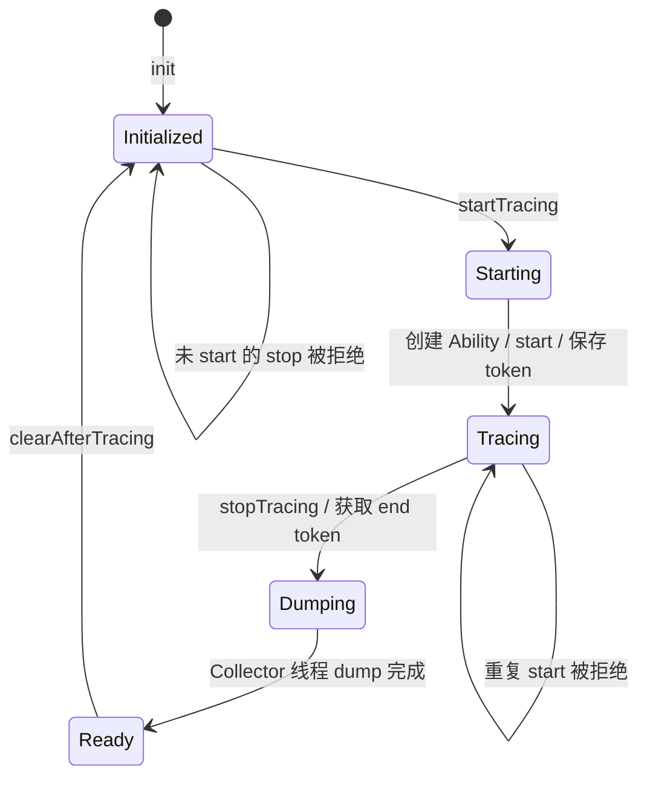

# App 端 SDK

> 适用对象：接入 SDK、排查端上生命周期或扩展 Trace Ability 的 Android/Java 贡献者。

## 正文

### 公共 API

`com.bytedance.rheatrace.RheaTrace3` 是源码注释明确声明的唯一外部 API：

| 方法 | 行为 | 约束 |
| --- | --- | --- |
| `init(Context)` | 主进程中初始化 TraceManager，可能启动启动阶段采集，并启动 HTTP 服务 | 应尽可能早地在 `attachBaseContext` 调用；非主进程直接返回 |
| `captureStackTrace(boolean force)` | 转发到 Native `TraceGlobal.capture`，在 Collector 工作时主动抓取当前线程栈 | `force=true` 只绕过时间间隔限制，不保证采集一定成功 |

noop 制品保留相同类和方法签名，方法体为空。业务代码只依赖 `RheaTrace3`，不应直接使用 `TraceManager`、`TraceProperties` 或 `trace.*` 包。

### 初始化和主进程判断

`ProcessUtils.isMainProcess` 通过当前 PID、`ActivityManager` 和包名判断主进程。判断通过后，`TraceManager.init`：

1. 检查 `debug.rhea3.startWhenAppLaunch`，为 `1` 时同步调用 `startTracing(false)`；
2. 计算内部目录 `<filesDir>/rhea/tracing/<pid>`；
3. 在新线程中启动 `HttpServer`，并把端口写入 `<externalFilesDir>/rhea-port/<port>`。

启动采集发生在 `tracingDirPath` 赋值之前，但 dump 只在后续 stop 时使用该路径；正常初始化顺序下 HTTP 服务和路径会在 CLI 停止采集前准备完成。

### TraceManager 状态机

`traceTokens != null` 是当前唯一的采集中标志。普通采集从 HTTP 线程异步启动 Ability；启动阶段采集同步启动。stop 会先清空 `traceTokens`，随后依次 stop Ability，再把 dump 工作投递到独立 HandlerThread。HTTP 下载通过 `dataFlushFinished` 等待 dump 完成。

### Ability 与配置抽象

- `TraceMeta` 保存能力名、是否核心数据、数组偏移、Ability 类型和配置创建器类型；当前只有 `Sampling`。
- `TraceAbilityCenter` 按 TraceMeta 反射创建并缓存 Ability。
- `TraceConfigurations` 按 TraceMeta 反射创建并缓存配置。
- `TraceAbility.start` 首次创建 Native Collector；嵌套 start 增加 `activeCount` 并更新可变配置。
- `TraceAbility.stop` 返回结束 token；`activeCount` 降为 0 时停止 Native Collector。
- `dumpTokenRange` 只为核心能力写入额外 JSON；当前额外信息包含 `processId`。

### Sampling 默认配置

`SamplingConfigCreator` 当前设置：boottime 时钟、相同的主/其他线程采样间隔、启用 rusage、对象分配统计、wakeup、线程名和 shadow pause。容量及间隔来自系统属性，缺失或非法时回退到 `SamplingConfig` 常量。

配置通过 `SamplingConfig.deflate()` 压缩为固定顺序的 `long[]` 传入 JNI。任何字段增删或顺序变化都属于 Java/Native 内部接口变更，必须同步修改 Native `SamplingConfig` 解析。

### 线程与错误行为

- HTTP Server 线程：接收控制与下载请求。
- Ability 异步启动线程：确保新线程路径触发相关 Hook 初始化。
- `RheaCollector` HandlerThread：执行 dump，避免阻塞 stop 请求线程。
- 重复 start、未 start 就 stop、Native 全局初始化失败、无可用 TraceMeta 会记录错误并返回 `false`。
- `HttpServer` 对 start/stop 当前不检查布尔返回值，HTTP 200 不等价于 Collector 一定成功；真正下载失败通过 query/error 和文件存在性表现。

## 相关源码

- [RheaTrace3](../rhea-library/rhea-inhouse/src/main/java/com/bytedance/rheatrace/RheaTrace3.java)
- [TraceManager](../rhea-library/rhea-inhouse/src/main/java/com/bytedance/rheatrace/TraceManager.java)
- [TraceAbility](../rhea-library/rhea-inhouse/src/main/java/com/bytedance/rheatrace/trace/base/TraceAbility.java)
- [SamplingConfigCreator](../rhea-library/rhea-inhouse/src/main/java/com/bytedance/rheatrace/trace/sampling/SamplingConfigCreator.java)

## 验证方式

1. 在主进程与远程进程各调用一次 `RheaTrace3.init`，确认只有主进程创建 `rhea-port`。
2. 连续请求两次 start、两次 stop，检查 `RheaTrace:Manager` 日志和 HTTP 返回的差异。
3. 修改采样间隔后通过 debug query 核对 token 范围和容量，不把 HTTP 200 当作唯一成功信号。

## 相关文档

- [快速开始](getting-started.md)
- [总体架构](architecture.md)
- [配置参考](configuration-reference.md)
- [Native 实现](native-runtime.md)
