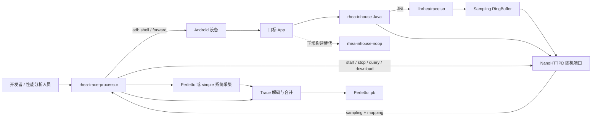
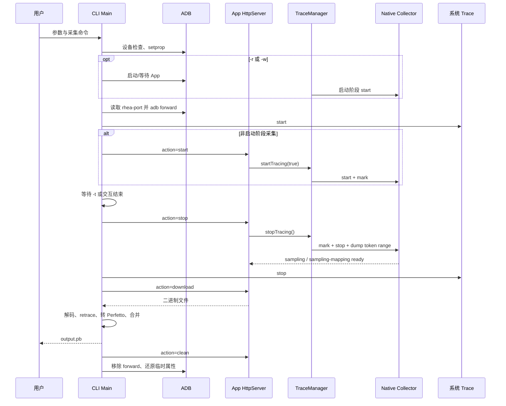
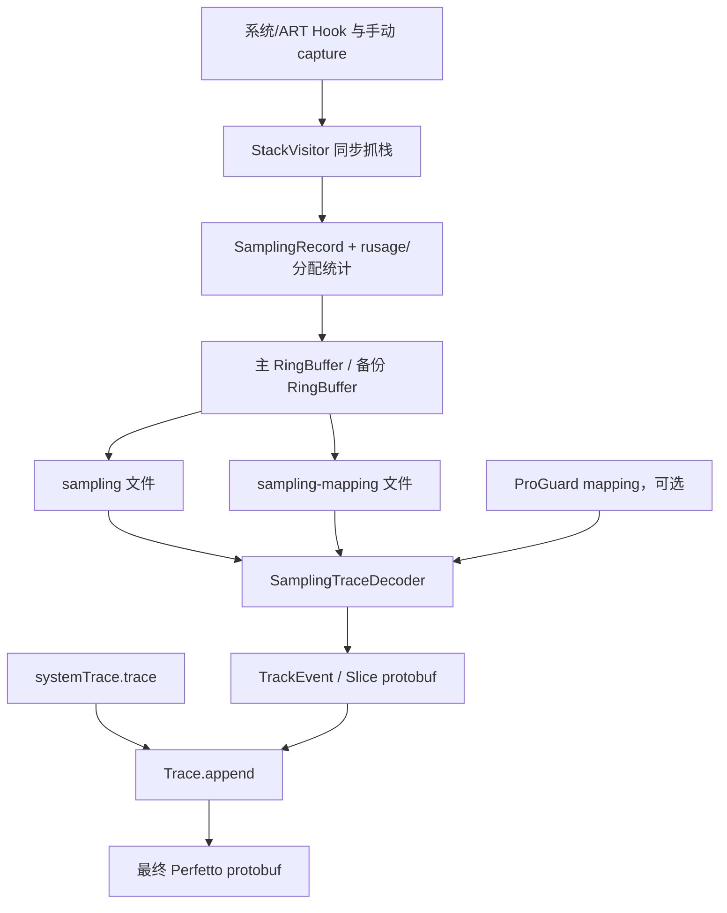
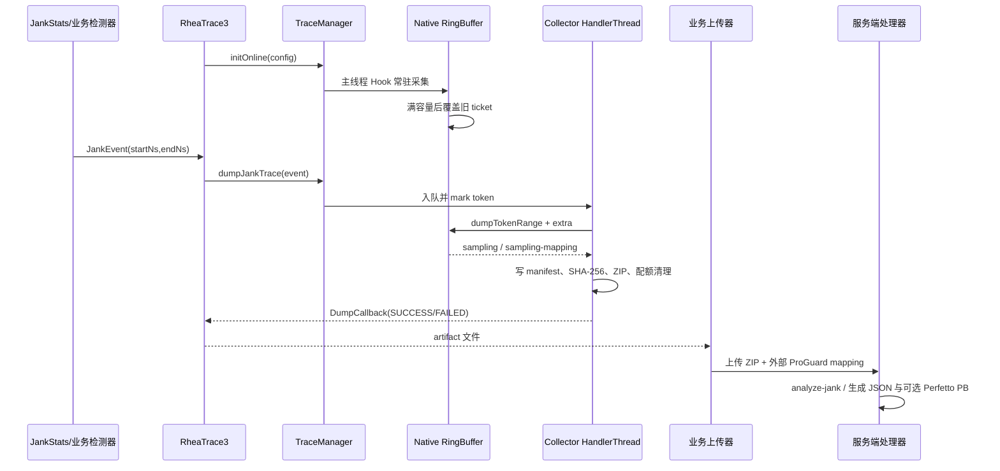

# 总体架构

> 适用对象：需要理解完整采集链路、定位跨模块问题或设计扩展的贡献者。

## 正文

### 模块关系

`app` 只负责示例和测试，不参与发布时的处理链。`rhea-inhouse` 与 `rhea-inhouse-noop` 共享唯一公开类 `RheaTrace3`。`rhea-trace-processor` 是 Java 8 CLI，同时包含 Perfetto 生成的 protobuf Java 类型和按操作系统选择的辅助脚本资源。

### 控制时序

### 数据流

### 在线卡顿链路

在线链路不经过调试 HTTP 或 ADB；SDK 只负责本地环形缓存和异步产物，网络重试、鉴权、存储及聚合由业务平台负责。

### 生命周期与边界

- `RheaTrace3.init` 仅主进程生效；多进程 App 的其他进程不会启动服务或采集。
- `RheaTrace3.initOnline` 同样只在主进程生效；它不启动 HTTP，前台/远程开关决定 Native 是否写入，导出在独立 HandlerThread 上完成。
- `TraceManager` 当前固定请求 `TraceMeta.Sampling`，抽象虽然支持扩展能力，但没有启用第二种 TraceMeta。
- start/stop 返回的 token 是 RingBuffer ticket 范围；dump 仅导出该区间，旧数据可能因容量不足被覆盖。
- App 数据和系统 Trace 独立开始/停止，CLI 最终以 protobuf 方式合并，因此异常退出可能只留下工作目录中的部分产物。
- HTTP 服务绑定随机可用端口，通过 App 外部文件目录暴露端口号，再由 ADB 转发到本机端口；它不是对外稳定的远程网络 API。

### 主要扩展点

1. 新增端上采集能力：扩展 `TraceMeta`、配置创建器、Java `TraceAbility`、JNI 创建分发和 Native `PerfCollector`。
2. 新增 Hook：在 Native `trace/` 中实现初始化/恢复，并接入 `trace::init` 生命周期。
3. 新增 CLI 输入或输出：扩展 `Arguments`、`Workspace`、下载流程和解码/转换流程。
4. 修改二进制格式：写入端和 Java 解码端必须同步升级版本并保持显式兼容策略。

## 相关源码

- [模块声明](../settings.gradle)
- [TraceManager](../rhea-library/rhea-inhouse/src/main/java/com/bytedance/rheatrace/TraceManager.java)
- [CLI Main](../rhea-tool/rhea-trace-processor/src/main/java/com/bytedance/rheatrace/Main.java)
- [Native CMake](../rhea-library/rhea-inhouse/src/main/cpp/CMakeLists.txt)

## 验证方式

1. 对照 `settings.gradle` 确认图中四个模块均存在。
2. 从 `Main.main` 跟踪一次 start、stop、download、process 调用，确认时序图没有跳过跨进程步骤。
3. 从 `SamplingCollector::request` 跟踪到 `StackTraceConvertor.convert`，确认数据流两端字段对应。

## 相关文档

- [App 端 SDK](app-sdk.md)
- [Native 实现](native-runtime.md)
- [CLI 处理器](cli-processor.md)
- [协议与数据格式](protocol-and-data-formats.md)
