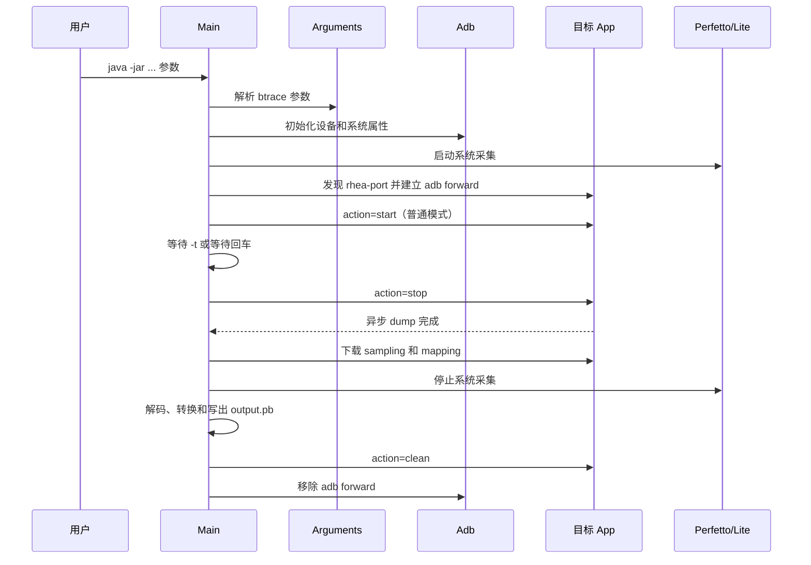
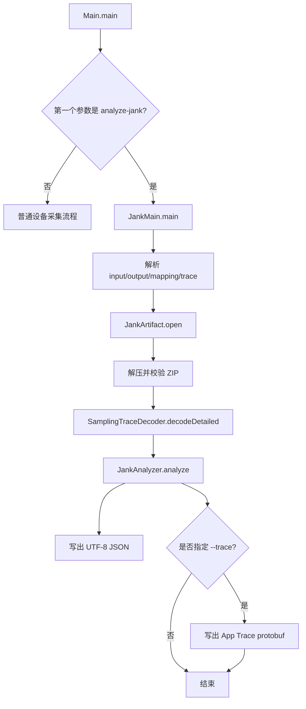
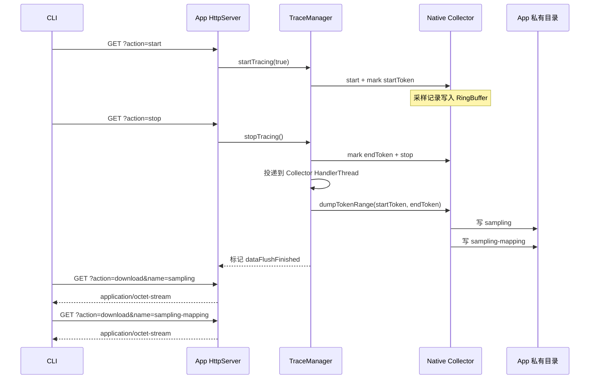
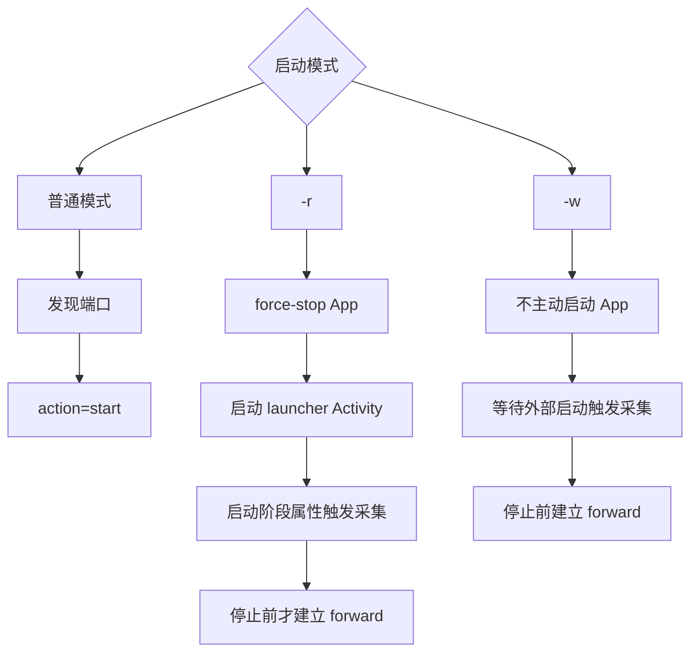
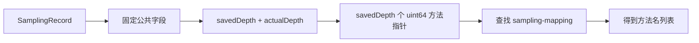
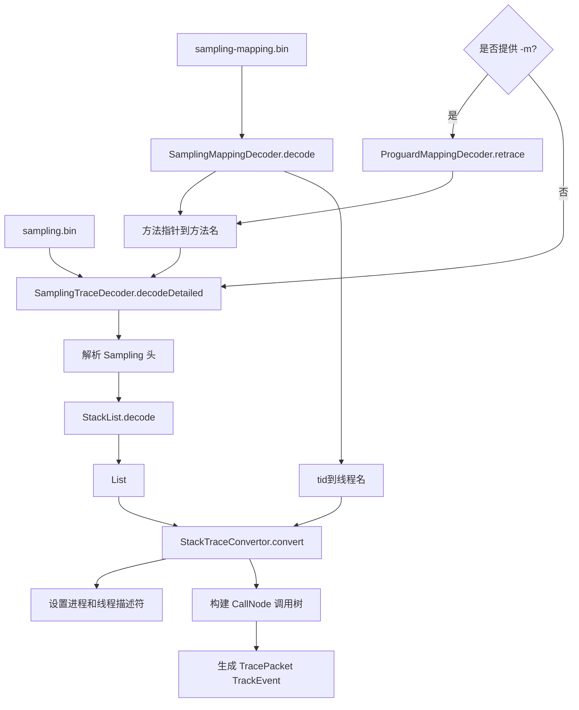
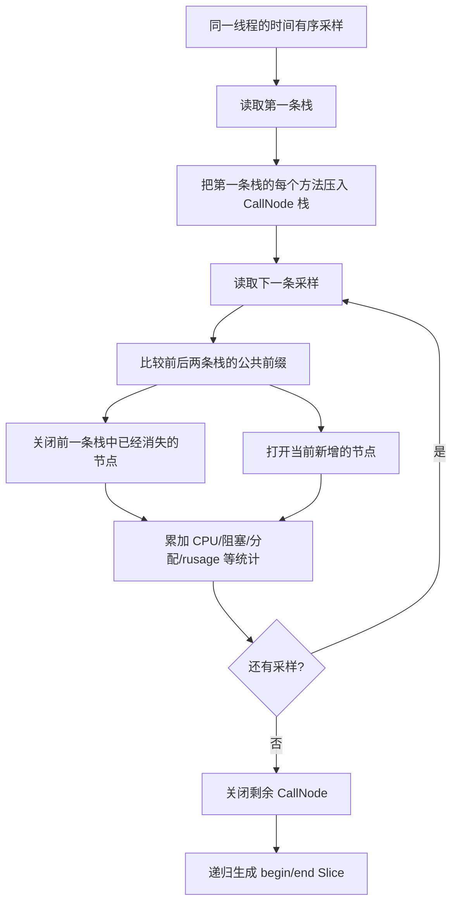
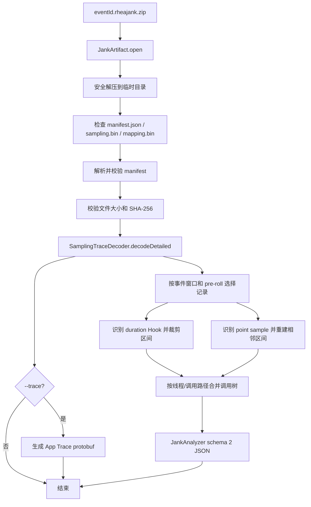
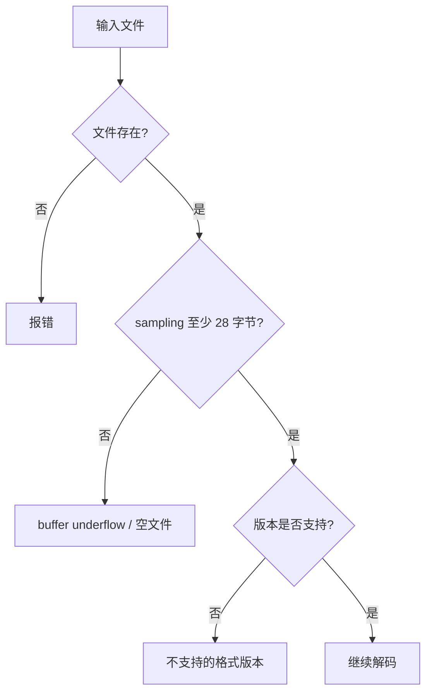

# 采样堆栈数据解析流程

> 本文说明 btrace Android 当前源码中的数据链路：端上如何采集和导出堆栈、CLI 如何解码 `sampling.bin`、如何重建调用树，以及如何生成 Perfetto `output.pb` 或在线卡顿 JSON。

## 适用对象

需要理解端上采样格式、CLI 解码实现、调用树重建或 Perfetto 输出的 Android/Java/C++ 开发者和性能分析人员。

## 正文

## 1. 先看结论

项目中存在三层不同的数据形态，不能混为一谈：

| 层级 | 典型文件 | 主要格式 | 作用 |
| --- | --- | --- | --- |
| 端上原始采样 | `sampling` / `sampling.bin` | Sampling v5 小端二进制 | 保存事件、时间、统计值和方法指针栈 |
| 端上符号映射 | `sampling-mapping` / `sampling-mapping.bin` | 自定义小端二进制 | 把方法指针解析成方法名，并保存线程名 |
| 处理器输出 | `output.pb` | Perfetto Trace protobuf 二进制 | 在 Perfetto UI 中展示进程、线程和调用栈 Slice |

在线卡顿模式在前两种文件外增加一层 ZIP：

```text
<eventId>.rheajank.zip
├── manifest.json
├── sampling.bin
└── sampling-mapping.bin
```

`manifest.json` 是 JSON；ZIP 内的两个 `*.bin` 文件仍然使用现有 Sampling v5 协议。

## 2. 总体数据流

```mermaid
flowchart LR
    Hook[系统/ART Hook] --> Capture[RheaTrace3.captureStackTrace]
    Capture --> Collector[Native SamplingCollector]
    Collector --> Stack[StackVisitor 同步抓栈]
    Stack --> Record[SamplingRecord]
    Record --> Ring[主 RingBuffer / 备份 RingBuffer]

    Ring -->|普通调试 stop| Dump[按 token 区间 dump]
    Dump --> Sampling[sampling]
    Dump --> Mapping[sampling-mapping]
    Sampling --> HTTP[App HTTP Server]
    Mapping --> HTTP
    HTTP --> ADB[ADB forward + CLI download]
    ADB --> Workspace[rheatrace.workspace]

    Ring -->|在线卡顿 dumpJankTrace| Artifact[manifest + 两个 bin 文件]
    Artifact --> Zip[eventId.rheajank.zip]
    Zip --> JankCLI[analyze-jank]

    Workspace --> Decode[SamplingTraceDecoder]
    Decode --> CallTree[StackTraceConvertor / CallNode]
    CallTree --> Trace[Trace protobuf builder]
    System[systemTrace.trace] --> Merge[Perfetto 模式字节拼接]
    Trace --> Merge
    Merge --> PB[output.pb]
    Trace --> SimplePB[simple 模式 output.pb]
    JankCLI --> Report[JankAnalyzer JSON]
    JankCLI --> JankPB[可选 App Trace protobuf]
```



核心边界是：

- Native 负责采集、缓存和导出 Sampling 二进制；
- CLI 负责符号解析、调用树重建和 Perfetto protobuf 生成；
- 线上卡顿的 JSON 统计由 `JankAnalyzer` 完成；
- `output.pb` 不是 `sampling.bin` 改名，而是重新构造出的 Perfetto Trace。

## 3. 两条 CLI 入口

### 3.1 普通设备采集入口

典型命令：

```powershell
java -jar rhea-trace-processor.jar `
  -a rhea.sample.android `
  -t 10 `
  -o output.pb `
  -r sched
```

入口类是 [`Main`](../rhea-tool/rhea-trace-processor/src/main/java/com/bytedance/rheatrace/Main.java)。`Main.main` 首先判断是否为 `analyze-jank`；不是时进入普通设备采集流程。



### 3.2 在线卡顿离线解析入口

```powershell
java -jar rhea-trace-processor.jar analyze-jank `
  --input event.rheajank.zip `
  --output event.json `
  --mapping mapping.txt `
  --trace event.pb
```

`Main.main` 看到第一个参数是 `analyze-jank` 后，直接把剩余参数交给 [`JankMain`](../rhea-tool/rhea-trace-processor/src/main/java/com/bytedance/rheatrace/jank/JankMain.java)，不连接设备，也不启动 Perfetto 系统采集。



## 4. 普通 CLI 的参数和工作目录

### 4.1 参数分层

[`Arguments.resolveArgs`](../rhea-tool/rhea-trace-processor/src/main/java/com/bytedance/rheatrace/core/Arguments.java) 会先消费 btrace 自己的参数，然后把剩余参数交给系统采集器：

| 参数 | 解析结果 | 后续用途 |
| --- | --- | --- |
| `-a <package>` | `appName` | 选择目标 App、生成进程名称 |
| `-t <seconds>` | `timeInSeconds` | 控制 CLI 等待时间；同时生成系统采集时长参数 |
| `-o <file>` | `outputPath` | 最终 Perfetto 输出路径 |
| `-m <file>` | `mappingPath` | 解析后对方法名 retrace |
| `-mode perfetto` | `mode` | 使用 `PerfettoCapture` |
| `-mode simple` | `mode` | 使用 `LiteCapture` |
| `-r` | `restart=true` | force-stop 后重新启动 App |
| `-w` | `waitStart=true` | 等待外部启动，不主动发送 `action=start` |
| `-sampleInterval` | 采样间隔 | 通过系统属性传给 App |
| `-maxAppTraceBufferSize` | App 缓冲容量 | 通过系统属性传给 App |
| `sched` 等剩余参数 | `systraceArgs` | 传给 `record_android_trace` |

如果没有指定 `-o`，CLI 会根据包名、版本和时间生成默认 `.pb` 文件名；如果没有传系统 category，则补充 `sched`。

`-o` 有一个容易忽略的行为：CLI 保存原始 `outputPath`，但把传给系统采集器的输出路径替换为工作目录中的 `systemTrace.trace`。这样系统采集文件和最终合并文件不会互相覆盖。

### 4.2 工作目录

[`Workspace.init`](../rhea-tool/rhea-trace-processor/src/main/java/com/bytedance/rheatrace/core/Workspace.java) 会创建并清空输出文件同级的 `rheatrace.workspace`：

```text
rheatrace.workspace/
├── systemTrace.trace       # Perfetto 模式的系统 Trace
├── sampling.bin            # 从 App 下载的采样文件
├── sampling-mapping.bin    # 从 App 下载的符号/线程映射
└── record_android_trace*   # 从 jar resource 解压的系统采集脚本
```

因此，不要把需要长期保留的手工文件放入该目录；每次 CLI 初始化时它会被清空。

## 5. 设备控制与原始文件导出

### 5.1 端口发现和 ADB 转发

App 启动 HTTP 服务后，会在外部文件目录创建：

```text
<externalFilesDir>/rhea-port/<port>
```

CLI 读取：

```text
/storage/emulated/0/Android/data/<package>/files/rhea-port
```

取出端口号后建立：

```text
adb forward tcp:<本地端口> tcp:<App 端口>
```

之后 CLI 访问的是本机地址：

```text
http://localhost:<本地端口>
```

实现见 [`Main.prepareAdbForward`](../rhea-tool/rhea-trace-processor/src/main/java/com/bytedance/rheatrace/Main.java) 和 [`Adb.Http`](../rhea-tool/rhea-trace-processor/src/main/java/com/bytedance/rheatrace/Adb.java)。

### 5.2 普通模式的请求顺序



`download` 请求会等待异步 dump 完成后再打开文件。CLI 下载时把设备端的无扩展名文件保存成工作目录中的 `sampling.bin` 和 `sampling-mapping.bin`。

### 5.3 `-r` 和 `-w` 的区别



## 6. `sampling.bin` 的解析

### 6.1 文件头

当前 Sampling Collector 使用格式版本 5，并以小端序写出。文件头固定为 28 字节：

| 偏移 | 类型 | 字段 | 当前含义 |
| ---: | --- | --- | --- |
| 0 | `uint32` | magic | `0x01020304` |
| 4 | `uint32` | type | Sampling 类型，当前为 0 |
| 8 | `uint32` | version | 当前为 5 |
| 12 | `uint64` | dumpTime | dump 时的启动时钟毫秒值 |
| 20 | `uint32` | count | 记录数量 |
| 24 | `int32` | extraLength | extra JSON 的字节数 |
| 28 | `byte[]` | extra | 进程、事件等 JSON 元数据 |

Native 侧的头部写入见 [`PerfBuffer::innerDump`](../rhea-library/rhea-inhouse/src/main/cpp/base/PerfBuffer.h)；Java 侧使用 `ByteOrder.LITTLE_ENDIAN` 读取见 [`SamplingTraceDecoder.decodeSampling`](../rhea-tool/rhea-trace-processor/src/main/java/com/bytedance/rheatrace/trace/SamplingTraceDecoder.java)。

当前 Java 解码器会读取 `count`，但实际通过 `StackList.decode` 按剩余字节循环解析记录。因此新增格式时不能只修改 count 含义，还必须同步修改 Native writer 和 Java decoder。

### 6.2 SamplingRecord

`SamplingRecord` 是 Native 侧的一条采样记录，负责保存一次事件的类型、线程、时间、资源统计和调用栈。结构体定义见 [`SamplingRecord`](../rhea-library/rhea-inhouse/src/main/cpp/sampling/SamplingRecord.h)，实际采集和赋值由 [`SamplingCollector::request`](../rhea-library/rhea-inhouse/src/main/cpp/sampling/SamplingCollector.cpp) 完成。

需要区分两个概念：

- C++ 中的 `SamplingRecord` 是运行时对象；
- `sampling.bin` 中保存的是 `encodeInto()` 按字段写出的变长二进制记录，不是 C++ 结构体内存的直接镜像，也不包含结构体 padding。

#### 6.2.1 字段说明

| 字段 | 类型 | 采集内容 | 解析后的用途 |
| --- | --- | --- | --- |
| `mType` | `SamplingType` | 采样事件类型 | 输出 `Type`，区分 Binder、GC、Monitor、Park 等事件 |
| `mTid` | `uint16_t` | `gettid()` 返回的 Linux 线程 ID | 按线程分组和重建线程调用树 |
| `mMessageId` | `uint32_t` | 当前线程的 Looper 消息编号 | 关联主线程采样点和 Java 消息周期 |
| `mNanoTime` | `uint64_t` | 纳秒级单调时间；瞬时事件是观察时间，持续事件是开始时间 | 计算开始时间、墙钟耗时以及采样顺序 |
| `mCpuTime` | `uint64_t` | 当前线程 CPU 时间；持续事件是开始 CPU 时间 | 计算线程实际消耗的 CPU 时间 |
| `mEndNanoTime` | `uint64_t` | 持续事件的结束时间；瞬时事件为 `0` | 生成结束采样点并计算持续时间 |
| `mEndCpuTime` | `uint64_t` | 持续事件结束时的线程 CPU 时间；瞬时事件为 `0` | 计算 CPU 时间增量 |
| `mAllocatedObjects` | `uint64_t` | 当前线程累计分配的 Java 对象数快照 | 与结束快照相减得到区间分配对象数 |
| `mAllocatedBytes` | `uint64_t` | 当前线程累计分配的字节数快照，单位为字节 | 与结束快照相减得到区间分配字节数 |
| `mMajFlt` | `uint32_t` | 当前线程累计 major page fault 次数 | 与结束快照相减得到区间缺页次数 |
| `mNvCsw` | `uint32_t` | 当前线程累计主动上下文切换次数，来源于 `ru_nvcsw` | 与结束快照相减得到区间主动切换次数 |
| `mNivCsw` | `uint32_t` | 当前线程累计被动上下文切换次数，来源于 `ru_nivcsw` | 与结束快照相减得到区间被动切换次数 |
| `mStack` | `Stack` | ART 调用栈及方法指针 | 结合 `sampling-mapping` 还原 Java 方法名和调用树 |

`mAllocatedObjects`、`mAllocatedBytes`、`mMajFlt`、`mNvCsw` 和 `mNivCsw` 都是累计快照，不应直接把多条记录相加。调用树转换阶段使用结束值减开始值，具体见 [`StackTraceConvertor.buildDebugInfo`](../rhea-tool/rhea-trace-processor/src/main/java/com/bytedance/rheatrace/trace/StackTraceConvertor.java)。

`mTid` 和文件中的 `tid` 都按 16 位保存；`mType` 在文件中也按 16 位保存。Native 只有在开启 `enableRusage` 且 `getrusage(RUSAGE_THREAD)` 成功时才采集后三个 rusage 字段。关闭该配置时，不应把这些原始字段解释为有效统计值。

#### 6.2.2 `mType` 事件类型

`SamplingType` 当前按以下协议值编码：

| 值 | 类型 | 含义 |
| ---: | --- | --- |
| 1 | `kInvalid` | 无效或占位类型 |
| 2 | `kBinder` | Binder 调用 |
| 3 | `kJankMessage` | 卡顿消息类别 |
| 4 | `kCustom` | 自定义或手动抓栈 |
| 5 | `kTraceStack` | 显式抓栈 |
| 6 | `kWait` | `Object.wait()` 等待 |
| 7 | `kPark` | `Unsafe.park()` 等待 |
| 8 | `kMonitor` | Java Monitor 进入或锁竞争 |
| 9 | `kObjectAllocation` | Java 对象分配 |
| 10 | `kJNITrampoline` | JNI 调用入口 |
| 11 | `kGC` | GC 等待过程 |
| 12 | `kMutex` | Native Mutex 阻塞 |
| 13 | `kDispatchVsync` | Vsync 分发 |
| 14 | `kSyncAndDrawFrame` | 帧同步与绘制 |
| 15 | `kTraceArg` | 带额外参数的抓栈事件 |
| 16 | `kFlush` | 最终异步抓栈标记 |
| 17 | `kUnpark` | `unpark` 唤醒 |
| 18 | `kScene` | 场景标记 |
| 19 | `kGCInternal` | GC 内部阶段 |
| 20 | `kLoadLibrary` | 动态库加载 |
| 21 | `kNativePollOnce` | Native 消息队列轮询 |
| 22 | `kNotify` | `notify/notifyAll` 唤醒 |
| 23 | `kUnlock` | Monitor 解锁唤醒 |

当前 Native 中可以直接看到的事件入口包括 Binder、GC、Monitor、Wait、Park、Unpark、Notify、Unlock、JNI、对象分配和动态库加载。部分枚举值是协议或处理器保留类别，是否产生记录取决于对应 Hook 和配置。新增或调整枚举顺序时必须同步更新 Java 映射并提升格式版本。当前 Java `CallNode` 映射表没有单独定义 `kLoadLibrary=20`，该类型进入处理器时可能显示为数值字符串 `"20"`。

#### 6.2.3 时间字段和持续事件

普通瞬时采样的字段关系是：

```text
mNanoTime      = 当前采样时间
mCpuTime       = 当前线程当前 CPU 时间
mEndNanoTime   = 0
mEndCpuTime    = 0
```

持续事件的字段关系是：

```text
mNanoTime      = 事件开始时间
mCpuTime       = 事件开始时的线程 CPU 时间
mEndNanoTime   = 事件结束时间
mEndCpuTime    = 事件结束时的线程 CPU 时间
```

因此：

```text
墙钟持续时间 = mEndNanoTime - mNanoTime
线程 CPU 时间 = mEndCpuTime - mCpuTime
```

`mNanoTime` 不是 Unix 时间戳，而是纳秒级单调时间。当前采样默认使用 `CLOCK_BOOTTIME`；具体开始时间由 Hook 传入，结束时间由 `SamplingCollector::request()` 采集。CPU 时间不包含线程睡眠或阻塞期间未消耗的 CPU 时间。

对于 `kUnpark`、`kNotify` 和 `kUnlock`，`mNanoTime` 特殊表示对应 `park`、`wait` 或锁竞争的开始时间，`mEndNanoTime` 表示唤醒或解锁发生的时间。Java 解码器使用开始时间建立唤醒关联，再将唤醒记录放在结束时间上，详见 [`StackList.decode`](../rhea-tool/rhea-trace-processor/src/main/java/com/bytedance/rheatrace/trace/StackList.java)。

#### 6.2.4 `mStack` 的内部结构

`mStack` 包含三个重要部分：

| 字段 | 含义 |
| --- | --- |
| `mSavedDepth` | 实际保存并写入文件的栈帧数量 |
| `mActualDepth` | ART 遍历得到的真实栈深度 |
| `mStackMethods` | 每个栈帧对应的 `ArtMethod*` 方法指针 |

最大栈深度为 `MAX_STACK_DEPTH=128`。Native 先计算：

```text
mSavedDepth = min(mActualDepth, 128)
```

随后 `SamplingCollector` 只接受 `mSavedDepth > 0` 且 `mSavedDepth == mActualDepth` 的结果。因此当前实现不会导出被截断的栈；超过 128 层的栈会被丢弃，相关逻辑见 [`StackVisitor`](../rhea-library/rhea-inhouse/src/main/cpp/sampling/StackVisitor.cpp)。

`mStackMethods` 保存的是进程内 ART 方法指针，不是方法名，也不是跨进程稳定 ID。dump 时 `SamplingDumper` 收集这些指针，并在 `sampling-mapping` 文件中写入指针到方法名的映射。Java 解码器读取后会反转 Native 写入的帧顺序，恢复从调用者到被调用者的顺序。

#### 6.2.5 记录的实际编码顺序和大小

当前公共记录的实际导出顺序如下。注意它与 C++ 结构体声明顺序不同：编码时 `endNanoTime` 写在 `cpuTime` 之前。

```text
uint16  type                 # 采样事件类型
uint16  tid                  # 线程 ID
uint32  messageId            # 关联消息或事件 ID
uint64  nanoTime             # 事件开始/观察时间
uint64  endNanoTime          # 事件结束时间
uint64  cpuTime              # 开始 CPU 时间
uint64  endCpuTime           # 结束 CPU 时间
uint64  allocatedObjects     # 已分配对象数量
uint64  allocatedBytes       # 已分配字节数
uint32  majFlt               # major page fault
uint32  nvCsw                # voluntary context switch
uint32  nivCsw               # involuntary context switch
uint32  savedDepth           # 实际保存的栈帧数
uint32  actualDepth          # ART 遍历得到的实际栈深度
uint64[] methodPointers      # savedDepth 个 ART 方法指针
```

当栈深度为 `d` 时，当前公共记录大小为：

```text
2 + 2 + 4 + 8 * 6 + 4 * 3 + (4 + 4 + 8 * d)
= 76 + 8 * d 字节
```

有效记录的栈深度至少为 1；最大深度 128 时，单条记录最大为 1100 字节。`SamplingRecord.encodeInto()` 和 `Stack::encodeInfo()` 的实现见 [`SamplingRecord.h`](../rhea-library/rhea-inhouse/src/main/cpp/sampling/SamplingRecord.h) 与 [`Stack.cpp`](../rhea-library/rhea-inhouse/src/main/cpp/sampling/Stack.cpp)。

记录尾部的栈编码是变长的：



Native 通过 [`SamplingRecord.encodeInto`](../rhea-library/rhea-inhouse/src/main/cpp/sampling/SamplingRecord.h) 和 [`Stack::encodeInfo`](../rhea-library/rhea-inhouse/src/main/cpp/sampling/Stack.cpp) 写入。当前 `SamplingCollector` 的模板参数 `dumpRawData=false`，所以导出的是逐字段编码的变长格式，而不是带 C++ 结构体 padding 的内存镜像。

当前 Java 解码器对 `kTraceArg` 还存在一个类型特例：会额外读取一个 `uint64` 参数并挂到栈项上。该类型的写入布局必须与对应 Native 版本保持一致，修改记录字段时要同步更新 Native 编码、Java 解码和格式版本。

### 6.3 Java 侧记录解码

[`StackList.decode`](../rhea-tool/rhea-trace-processor/src/main/java/com/bytedance/rheatrace/trace/StackList.java) 的主要行为：

1. 按 Sampling 版本读取时间、CPU、分配和 rusage 字段；
2. 读取 `savedDepth`、`actualDepth` 和方法指针；
3. 用映射表把指针转换成 `MethodSymbol`；
4. 反转栈帧顺序，恢复从调用者到被调用者的顺序；
5. 丢弃 `actualDepth != savedDepth` 或空栈等无效记录；
6. 对带结束时间的记录生成开始项和结束项；
7. 处理 `kUnlock`、`kUnpark`、`kNotify` 等唤醒关系；
8. 对 `kFlush` 等特殊事件执行额外的栈处理；
9. 按 `nanoTime` 排序，返回 `List<StackList>`。

这里得到的 `StackList` 仍然是处理器内部模型，不是最终的 Perfetto 数据。

## 7. `sampling-mapping.bin` 的解析

### 7.1 文件结构

```text
uint64  magic                 # 当前 Native 写 0
uint32  version               # 当前为 1
uint32  methodCount

重复 methodCount 次：
    uint64  methodPointer
    uint16  symbolLength
    byte[]  symbol

剩余区域为线程名：
    uint16  tid
    uint8   nameLength
    byte[]  threadName
```

Native 侧在 dump 时只收集本次采样记录引用过的方法指针，然后调用 ART 的 pretty method 能力得到符号字符串；线程名从 `/proc/self/task/<tid>/comm` 读取。

Java 侧由 [`SamplingMappingDecoder`](../rhea-tool/rhea-trace-processor/src/main/java/com/bytedance/rheatrace/trace/SamplingMappingDecoder.java) 解码成两个 Map：

```java
Map<Long, MethodSymbol> symbolMapping;
Map<Integer, String> threadNames;
```

需要区分两种 mapping：

- `sampling-mapping.bin`：端上 Native 方法指针到方法名、线程名的映射；
- `-m mapping.txt`：外部 R8/ProGuard 混淆映射，用于再次还原 Java 方法名。

## 8. 方法名还原和调用树重建

### 8.1 完整解码顺序



### 8.2 调用树算法

`StackTraceConvertor` 首先按 tid 分组，每个线程分别处理：



相邻两条栈的处理逻辑可以抽象为：

```text
上一条栈：A -> B -> C -> D
当前栈：  A -> B -> E

保留：A、B
结束：C、D
开始：E
```

这样，采样点序列最终被转换成嵌套的调用区间。对于原始记录中已经提供成对开始/结束时间的 Hook，解码器会保留这类 duration 语义；对于普通点采样，转换器只能依据相邻采样构造可视化区间，不能据此证明方法连续执行了整个采样间隔。

### 8.3 Slice 的调试信息

每个调用节点写成：

```text
TracePacket(timestamp=beginTime)
    TrackEvent(TYPE_SLICE_BEGIN, name=方法名)

TracePacket(timestamp=endTime)
    TrackEvent(TYPE_SLICE_END)
```

`TYPE_SLICE_BEGIN` 的 debug annotations 会携带：

```text
WakeUpBy
BlockTime
CPUTime
Count
Gap
Gap.CPU
SelfTime
SelfCpuTime
Type
MessageId
AllocatedObjects
AllocatedBytes
AllocatedBytesNum
MajFlt
NvCsw
NivCsw
_Begin
_End
Arg（如果事件带参数）
```

这些字段不是额外的 JSON 文件，而是写在 Perfetto `TrackEvent.debug_annotations` 中。

## 9. `Trace` protobuf 的构造

### 9.1 进程和线程描述符

`StackTraceConvertor` 先调用 `Trace.setProcess` 和 `Trace.setThread`。第一次加入 Slice 时，`Trace` 会延迟注入 TrackDescriptor：

```mermaid
flowchart TD
    SetProcess[setProcess(pid, appName)] --> ProcessMap[内部 processMap]
    SetThread[setThread(pid, tid, name)] --> ProcessMap
    FirstSlice[第一次 addSlice] --> Descriptor[生成 TrackDescriptor]
    ProcessMap --> Descriptor
    Descriptor --> ProcessTrack[进程 Track]
    Descriptor --> ThreadTrack[线程 Track，parentUuid 指向进程]
    ProcessTrack --> Slice[TrackEvent 使用 trackUuid]
    ThreadTrack --> Slice
```

进程 Track 和线程 Track 使用 UUID 区分，后续的 `TrackEvent` 通过 `track_uuid` 绑定到对应线程。

### 9.2 ProcessTree

调用 `Trace.marshal` 时会追加 `ProcessTree` packet，包含：

```text
processes: pid、cmdline
threads:   tid、tgid、name
```

因此 Perfetto UI 可以同时显示进程树、线程名称和线程轨道。实现见 [`Trace.injectProcessTreePacket`](../rhea-tool/rhea-trace-processor/src/main/java/com/bytedance/rheatrace/perfetto/Trace.java)。

### 9.3 写出 protobuf

```mermaid
flowchart LR
    Builder[TraceOuterClass.Trace.Builder]
    Builder --> Descriptor[TrackDescriptor packets]
    Builder --> Events[TrackEvent packets]
    Builder --> Tree[ProcessTree packet]
    Descriptor --> Marshal[Trace.marshal]
    Events --> Marshal
    Tree --> Marshal
    Marshal --> Write[writeTo(OutputStream)]
    Write --> AppPB[App Trace protobuf bytes]
```

`Trace.marshal` 最终调用生成的 protobuf 类的 `writeTo(out)`，所以 `output.pb` 是 protobuf wire format 的二进制文件，不是可直接用文本编辑器查看的结构化文本。

## 10. `output.pb` 的两种生成方式

### 10.1 Perfetto 模式

[`PerfettoCapture.process`](../rhea-tool/rhea-trace-processor/src/main/java/com/bytedance/rheatrace/perfetto/PerfettoCapture.java) 的当前实现是：

```text
创建 output.pb
    ↓
复制 systemTrace.trace 原始字节
    ↓
SamplingTraceDecoder.decode()
    ↓
sampleTrace.marshal(output)
    ↓
关闭 output.pb
```

`systemTrace.trace` 和 `sampleTrace.marshal()` 都是同一个 Perfetto 顶层 Trace protobuf 的序列化数据。由于顶层 `packet` 是 repeated 字段，源码采用字节级追加的方式把两部分合成一个可被 Perfetto 读取的 Trace 流。

因此 Perfetto 模式的结果包含：

```text
系统轨道：sched、ftrace 等
    +
App 轨道：btrace 采样转换出的线程调用栈 Slice
```

### 10.2 simple 模式

[`LiteCapture.process`](../rhea-tool/rhea-trace-processor/src/main/java/com/bytedance/rheatrace/lite/LiteCapture.java) 不创建系统 Trace，只执行：

```text
sampling.bin
    ↓
SamplingTraceDecoder
    ↓
StackTraceConvertor
    ↓
Trace.marshal(output.pb)
```

此时 `output.pb` 只有 App 侧的进程、线程和调用栈数据。

## 11. 在线卡顿 ZIP 的解析流程

在线产物的解析入口是 [`JankMain`](../rhea-tool/rhea-trace-processor/src/main/java/com/bytedance/rheatrace/jank/JankMain.java)。它和普通 CLI 共享 `SamplingTraceDecoder`，但多了一层 ZIP 校验和卡顿窗口统计。



`JankAnalyzer` 输出 schema 2 报告。`completeStack` 以 `processId` 对应的主线程为主调用树，`otherThreads` 保存其他线程；相同父节点下的同名方法会合并为一个节点，方法节点按真实调用关系嵌套。

每个方法节点会区分：

- `durationNs`：调用树重建后的 inclusive 墙钟耗时；
- `selfDurationNs`：扣除子方法区间后的自身耗时；
- `exactDurationNs`：
  来自成对开始/结束记录的精确耗时；
- `estimatedDurationNs`：由点采样相邻时间重建的估算耗时；
- `durationSource`：`exact`、`estimated`、`mixed` 或 `unknown`。

报告级统计仍包括：

- `exactDurationNs`：来自成对开始/结束记录的精确耗时；
- `pointSampleCount`：某个时刻观察到的点采样数量；
- `warnings`：空采样、没有相关采样、只有点采样、RingBuffer 截断等。

`preRollMs` 只用于补齐事件开始时的调用链上下文，所有方法耗时都裁剪到 `[eventStart, eventEnd)`。点采样不能通过“次数 × 采样间隔”推断连续执行时间；如果没有 duration hook，报告会保留估算值并在 `warnings` 中提示。

在线 `--trace` 生成的是 App 采样的 Perfetto protobuf，不会像普通 `-mode perfetto` 那样合并 `systemTrace.trace`。

## 12. 失败和数据质量边界

### 12.1 文件级错误



常见边界包括：

- `sampling.bin` 少于 28 字节：无法读取文件头；
- ZIP 缺少必需文件：`JankArtifact` 拒绝解析；
- `schemaVersion` 或 `samplingFormatVersion` 不支持：拒绝解析；
- `-m` 指向的 mapping 文件不存在：CLI 在参数阶段失败；
- 没有记录或 extra 中没有 `processId`：普通解码可能返回空 Trace；
- 方法指针在 mapping 中找不到：对应栈帧无法还原；
- RingBuffer 已覆盖旧记录：只能解析当前仍保留的窗口。

### 12.2 语义边界

点采样不是连续执行证明。即使采样间隔是 10 ms，也不能简单把点采样数量乘以 10 ms 得到方法耗时。只有具备有效开始/结束时间的 Hook 记录，才能进入精确 duration 统计。

## 相关源码

| 阶段 | 入口/实现 | 主要职责 |
| --- | --- | --- |
| CLI 编排 | [`Main`](../rhea-tool/rhea-trace-processor/src/main/java/com/bytedance/rheatrace/Main.java) | 参数后的设备采集、停止、下载和清理 |
| 参数处理 | [`Arguments`](../rhea-tool/rhea-trace-processor/src/main/java/com/bytedance/rheatrace/core/Arguments.java) | btrace 参数和系统采集参数分层 |
| 工作目录 | [`Workspace`](../rhea-tool/rhea-trace-processor/src/main/java/com/bytedance/rheatrace/core/Workspace.java) | 管理 `systemTrace.trace`、两个 `bin` 和最终输出 |
| Perfetto 系统采集 | [`PerfettoCapture`](../rhea-tool/rhea-trace-processor/src/main/java/com/bytedance/rheatrace/perfetto/PerfettoCapture.java) | 启动脚本、停止系统采集、合并输出 |
| simple 模式 | [`LiteCapture`](../rhea-tool/rhea-trace-processor/src/main/java/com/bytedance/rheatrace/lite/LiteCapture.java) | 仅输出 App Trace |
| Sampling 总解码 | [`SamplingTraceDecoder`](../rhea-tool/rhea-trace-processor/src/main/java/com/bytedance/rheatrace/trace/SamplingTraceDecoder.java) | 组织 mapping、采样和 retrace |
| Mapping 解码 | [`SamplingMappingDecoder`](../rhea-tool/rhea-trace-processor/src/main/java/com/bytedance/rheatrace/trace/SamplingMappingDecoder.java) | 指针符号和线程名 |
| 记录解码 | [`StackList`](../rhea-tool/rhea-trace-processor/src/main/java/com/bytedance/rheatrace/trace/StackList.java) | SamplingRecord 到内部采样模型 |
| 调用树转换 | [`StackTraceConvertor`](../rhea-tool/rhea-trace-processor/src/main/java/com/bytedance/rheatrace/trace/StackTraceConvertor.java) | 内部采样模型到调用树和 Slice |
| Trace 构造 | [`Trace`](../rhea-tool/rhea-trace-processor/src/main/java/com/bytedance/rheatrace/perfetto/Trace.java) | TrackDescriptor、TrackEvent、ProcessTree protobuf |
| 在线 ZIP | [`JankArtifact`](../rhea-tool/rhea-trace-processor/src/main/java/com/bytedance/rheatrace/jank/JankArtifact.java) | 解压、安全校验和 SHA-256 校验 |
| 在线报告 | [`JankAnalyzer`](../rhea-tool/rhea-trace-processor/src/main/java/com/bytedance/rheatrace/jank/JankAnalyzer.java) | 精确耗时、点采样和 JSON |

## 验证方式

构建处理器：

```powershell
.\gradlew.bat :rhea-trace-processor:build
```

运行普通采集：

```powershell
java -jar rhea-trace-processor.jar -a your.package -t 10 -o output.pb sched
```

运行 simple 模式：

```powershell
java -jar rhea-trace-processor.jar -a your.package -t 10 -mode simple -o output.pb
```

解析在线卡顿产物：

```powershell
java -jar rhea-trace-processor.jar analyze-jank `
  --input event.rheajank.zip `
  --output event.json `
  --trace event.pb
```

建议保留以下中间文件用于排障：

```text
systemTrace.trace
sampling.bin
sampling-mapping.bin
最终 output.pb 或 event.json
```

## 相关文档

- [总体架构](architecture.md)
- [CLI 处理器](cli-processor.md)
- [协议与数据格式](protocol-and-data-formats.md)
- [在线卡顿采集](online-jank.md)
- [源码参考](source-reference.md)
