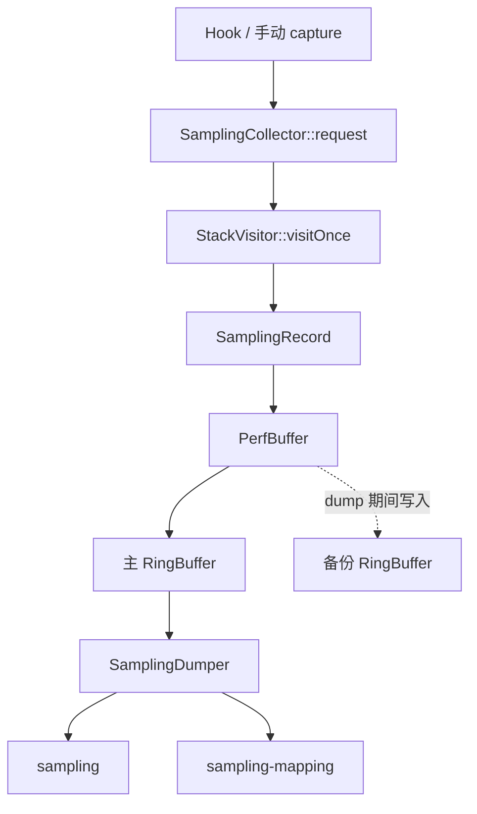

# Native 实现

> 适用对象：维护 JNI、ART Hook、同步抓栈、性能计数或二进制导出的 C/C++ 贡献者。

## 正文

### 加载与 JNI 边界

`RheaOnLoad.cpp` 在 `JNI_OnLoad` 中保存 JavaVM，并注册 `TraceGlobal`、`TraceAbility` 等 Native 方法。Java 侧主要边界如下：

| Java 调用 | Native 入口 | 作用 |
| --- | --- | --- |
| `TraceGlobal.nativeInit` | `TraceGlobalJni.cpp` | 初始化全局上下文、主线程和 JNI Hook |
| `TraceGlobal.nativeCapture` | `TraceGlobalJni.cpp` | 请求一次当前线程同步抓栈 |
| `TraceAbility.nativeCreate` | `TraceAbilityJni.cpp` | 按 TraceMeta offset 创建 Collector |
| `nativeStart/nativeStop` | `TraceAbilityJni.cpp` | 启停 Collector 和 Hook 生命周期 |
| `nativeMark` | `TraceAbilityJni.cpp` | 返回当前 RingBuffer ticket |
| `nativeDumpTokenRange` | `TraceAbilityJni.cpp` | 导出指定 ticket 区间 |

`RheaContext` 保存运行期共享状态。JNI 层使用裸 `jlong` 传递 Collector 指针，因此 Java 与 Native 的生命周期、类型 offset 和配置数组顺序必须严格一致。

### Collector 与缓存

`SamplingCollector` 是当前唯一 Collector。首次创建时根据 `SamplingConfig.capacity` 分配 `PerfBuffer<SamplingRecord>`。每次 request 会先检查暂停状态和最小间隔，再同步访问当前线程栈；只有保存深度等于实际深度时才写入。

`SamplingRecord` 保存事件类型、线程 ID、消息 ID、开始/结束 wall time 与 CPU time、对象分配数量/字节、major fault、主动/被动上下文切换和堆栈。时间字段采用配置的 clock；默认配置为 boottime。

RingBuffer 使用递增 ticket 标识记录位置。容量用尽后槽位被覆盖；dump 根据 start/end token 导出仍可用区间。备份 buffer 用于 dump 等场景下继续接收写入，具体切换逻辑由 `PerfBuffer` 管理。

### 抓栈与采样点

- `StackVisitor` 负责访问 ART 线程栈并填充 `Stack`。
- `SamplingTrace` 提供不同事件的采集入口，最终统一调用 `SamplingCollector::request`。
- `force` 绕过 `lastJavaNano` 间隔判断；正常采样按主线程或其他线程间隔限流。
- `captureAtEnd` 事件同时记录开始/结束时间和 CPU time；瞬时事件只记录当前时间。
- `messageIndex` 与 `lastJavaNano` 是 thread-local，消息边界和采样限流互不跨线程。

### Hook 组件

| 组件 | 观测目标 | 主要产出 |
| --- | --- | --- |
| `TraceBinderCall` | Binder 调用 | Binder 类型采样记录 |
| `TraceGC` | GC 与 GC 内部阶段 | GC 区间/事件 |
| `TraceJNICall` | JNI trampoline | JNI 调用采样记录 |
| `TraceJavaMonitor` | monitor 锁竞争 | Monitor/Mutex/Unlock 相关记录 |
| `TraceLoadLibrary` | 动态库加载 | LoadLibrary 记录 |
| `TraceMessageIDChange` | 主线程消息边界 | 消息 ID 递增及关联 |
| `TraceObjectWait` | Object.wait/notify | Wait/Notify 区间与唤醒关系 |
| `TraceUnsafePark` | park/unpark | Park/Unpark 区间与唤醒关系 |
| `TraceJavaAlloc` | Java 对象分配 | 分配计数与字节统计 |

Hook 的可用性依赖 Android/ART 版本、目标符号和 ShadowHook。初始化失败、符号缺失或签名变化应被视为设备兼容问题，而不是在文档中假设所有系统版本都支持相同观测项。

### dump 与错误码

`PerfCollectorBaseImpl` 创建 `<name>` 和可选的 `<name>-mapping` 文件，随后由 `PerfBuffer::dumpPart` 导出。文件头包含 magic、type、version、时间、记录数和 extra JSON 长度；采样记录由 `SamplingDumper` 变长编码，mapping 另行写入方法指针、符号和线程名。

常见非零结果来自创建目录/文件失败、`ftruncate`、`mmap` 或无 Dumper。JNI 将结果返回 Java，`TraceManager` 逐 Ability 记录日志；当前 `onTraceDumpFinished` 只对创建 dump 目录失败传递非零 code，单个 Ability dump 的非零结果不会改变最终回调 code，排障时必须同时查看 logcat 和下载结果。

### 安全修改规则

1. 修改 `SamplingRecord` 编码时同步更新 Java `StackList.decode` 和格式版本。
2. 修改配置数组时同步更新 Java `SamplingConfig.deflate` 与 C++ `SamplingConfig` 构造/更新顺序。
3. 新增 Hook 时保证初始化可失败、停止可恢复，并验证多个 Android API/ABI。
4. 处理 ART 内部结构时不要把单个系统镜像或符号名推广为普遍兼容性结论。
5. 涉及 signal、mmap、线程暂停或 JNI 引用的变更必须进行真机压力测试。

## 相关源码

- [Native CMake](../rhea-library/rhea-inhouse/src/main/cpp/CMakeLists.txt)
- [SamplingCollector](../rhea-library/rhea-inhouse/src/main/cpp/sampling/SamplingCollector.cpp)
- [SamplingRecord](../rhea-library/rhea-inhouse/src/main/cpp/sampling/SamplingRecord.h)
- [PerfBuffer](../rhea-library/rhea-inhouse/src/main/cpp/base/PerfBuffer.h)

## 验证方式

1. 至少在 arm64 真机上运行启动采集和普通采集，记录 API/ABI。
2. 使用小 buffer 制造覆盖，确认 debug query 的 `end - start > capacity` 与 CLI 警告一致。
3. 对新增 Hook 分别验证命中、符号缺失、重复 start/stop 和 App 退出恢复路径。
4. 对格式变更保留旧样本，验证新 CLI 的兼容或明确拒绝行为。

## 相关文档

- [App 端 SDK](app-sdk.md)
- [协议与数据格式](protocol-and-data-formats.md)
- [源码参考](source-reference.md)
- [开发与发布](development-and-release.md)
